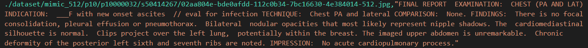

# Advancing Radiograph Representation Learning with Masked Record Modeling (MRM)
This repository includes an official implementation of paper: [Advancing Radiograph Representation Learning with Masked Record Modeling (ICLR'23)](https://openreview.net/forum?id=w-x7U26GM7j).

Some code is borrowed from [MAE](https://github.com/facebookresearch/mae), [huggingface](https://huggingface.co), and [REFERS](https://github.com/funnyzhou/REFERS).

## 1 Environmental preparation and quick start
**Environmental requirements**
- Ubuntu 18.04 LTS.

- Python 3.8.11

If you are using anaconda/miniconda, we provide an easy way to prepare the environment for pre-training and finetuning of classification:

      conda env create -f environment.yaml
      pip install -r requirements.txt

## 2 How to load the pre-trained model
Download the [pre-trained weight](https://drive.google.com/file/d/1JwZaqvsSdk1bD3B7fsN0uOz-2Fzz1amc/view) first!
```python
import torch
import torch.nn as nn
from functools import partial
import timm
assert timm.__version__ == "0.6.12"  # version check
from timm.models.vision_transformer import VisionTransformer

def vit_base_patch16(**kwargs):
    model = VisionTransformer(norm_layer=partial(nn.LayerNorm, eps=1e-6),**kwargs)
    return model

# model definition
model = vit_base_patch16(num_classes=14,drop_path_rate=0.1,global_pool="avg")
checkpoint_model = torch.load("./MRM.pth", map_location="cpu")["model"]
# load the pre-trained model
model.load_state_dict(checkpoint_model, strict=False)
```

## 3 Pre-training
### 3.1 Data preparation for pre-training
- We use MIMIC-CXR-JPG for pre-training. You can acquire more information about this dataset at [Johnson et al. MIMIC-CXR-JPG](https://physionet.org/content/mimic-cxr-jpg/2.0.0/).
- The dataset directory specified in [run.sh](/run.sh) includes the MIMIC-CXR-JPG dataset and you need to prepare a file ``training.csv`` and put it into the dataset directory.
- The file ``training.csv`` includes two columns ``image_path`` and ``report_content`` for each line, corresponding to (a) the path to an image and (b) the text of the corresponding report, respectively, which should be organized as follows:
```
      image_path, report_content
      /path/to/img1.jpg, FINAL REPORT  EXAMINATION: ...
      /path/to/img2.jpg, FINAL REPORT  CHEST: ...
      ...,...
```
- take one line as an example:


### 3.2 Start pre-training
- Download the pre-trained weight of [MAE](https://dl.fbaipublicfiles.com/mae/pretrain/mae_pretrain_vit_base.pth) and set ``resume`` to the path of the pre-trained weight in [run.sh](run.sh).
- Set the data path, GPU IDs, batch size, output directory, and other parameters in [run.sh](run.sh).

- Start training by running
```
      chmod a+x run.sh
      ./run.sh
```
## 4 Fine-tuning of classification (take NIH ChestX-ray 14 dataset as the example)
### 4.1 Data preparation
- Download NIH ChestX-ray 14 dataset and split [train/valid/test](DatasetsSplits/NIH_ChestX-ray) set. The directory should be organized as follows:
```
      NIH_ChestX-ray/
            all_classes/
                  xxxx1.png
                  xxxx2.png
                  ...
                  xxxxn.png
            train_1.txt
            trian_10.txt
            train_list.txt
            val_list.txt
            test_list.txt
```	
- Specify the ``dataset_path`` in [finetuning_1percent.sh](/NIH_ChestX-ray/finetuning_1percent.sh), [finetuning_10percent.sh](/NIH_ChestX-ray/finetuning_10percent.sh), [finetuning_100percent.sh](/NIH_ChestX-ray/finetuning_100percent.sh), [test.py](/NIH_ChestX-ray/test.py).

### 4.2 Start fine-tuning (take 1 percent data as the example)
- Download the pre-trained weight from [Google Drive](https://drive.google.com/file/d/1JwZaqvsSdk1bD3B7fsN0uOz-2Fzz1amc/view?usp=sharing) and specify ``pretrained_path`` in [finetuning_1percent.sh](/NIH_ChestX-ray/finetuning_1percent.sh).

- Start training by running
```
      chmod a+x finetuning_1percent.sh
      ./finetuning_1percent.sh
```
### 4.3 More fine-tuning hyperparameters
|     RSNA    |     warm up setps    |     total steps    |     learning rate    |   |
|-------------|----------------------|--------------------|----------------------|---|
|     1%      |     50               |     2000           |     3e-3             |   |
|     10%     |     200              |     10000          |     5e-4             |   |
|     100%    |     2000             |     50000          |     5e-4             |   |

|     CheXpert    |     warm up setps    |     total steps    |     learning rate    |
|---------------------|----------------------|--------------------|----------------------|
|     1%              |     150              |     2000           |     3e-3             |
|     10%             |     1500             |     60000          |     5e-4             |
|     100%            |     15000            |     200000         |     5e-4             |

|     Covid    |     warm up setps    |     total steps    |     learning rate    |
|--------------|----------------------|--------------------|----------------------|
|     100%     |     50               |     1000           |     3e-2             |
|              |                      |                    |                      |
## 5 Fine-tuning of segmentation
### 5.1 Data preparation
- Download SIIM-ACR Pneumothorax and preprocess the images and annotations.
Then organize the directory as follows:
```
      siim/
            images/
                  training/
                        xxxx1.png
                        xxxx2.png
                        ...
                        xxxxn.png
                  validation/
                        ...
                  test/
                        ...

            annotations/
                  training/
                        xxxx1.png
                        xxxx2.png
                        ...
                        xxxxn.png
                  validation/
                        ...
                  test/
                        ...
```
### 5.2 Necessary files for segmentation
We conduct all experiments  of segmentation by [MMSegmentaiton](https://github.com/open-mmlab/mmsegmentation) (version  0.25.0) and it is necessary to set the environment and comprehend the code structures of MMSegmentaiton in advance.

Here we provide the necessary configuration files for reproducing the experiments in the directory [Siim_Segmentation](Siim_Segmentation). After modifying MMSegmentaiton framework with provided files, start fine-tuning and evaluation with [ft.sh](Siim_Segmentation/ft.sh) and [test.sh](Siim_Segmentation/test.sh), respectively.

## 6 Links to download datasets
- [MIMIC-CXR-JPG](https://physionet.org/content/mimic-cxr-jpg/2.0.0/)

- [NIH ChestX-ray](https://nihcc.app.box.com/v/ChestXray-NIHCC/folder/36938765345)

- [CheXpert](https://stanfordmlgroup.github.io/competitions/chexpert/#:~:text=What%20is%20CheXpert%3F,labeled%20reference%20standard%20evaluation%20sets.)

- [RSNA Pneumonia](https://www.kaggle.com/competitions/rsna-pneumonia-detection-challenge)

- [COVID-19 Image Data Collection](https://github.com/ieee8023/covid-chestxray-dataset)

- [SIIM-ACR Pneumothorax](https://www.kaggle.com/c/siim-acr-pneumothorax-segmentation)

## 7 Datasets splits
In the directory [DatasetsSplits](DatasetsSplits), we provide dataset splits that may be helpful for organizing the datasets.

We give the train/valid/test splits of [CheXpert](DatasetsSplits/CheXpert), [NIH ChestX-ray](DatasetsSplits/NIH_ChestX-ray), and [RSNA Pneumonia](DatasetsSplits/RSNA_Pneumonia).

For [COVID-19 Image Data Collection](DatasetsSplits/COVID-19_Image_Data_Collection), we randomly split the train/valid/test set 5 times and we provide the images in the [images](DatasetsSplits/COVID-19_Image_Data_Collection/images) directory.

For [SIIM-ACR_Pneumothorax](DatasetsSplits/SIIM-ACR_Pneumothorax), please organize the directories of images and annotations as section 5.1 mentioned according to the given splits.